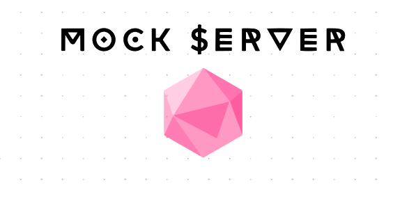

## Mock Server

The Mock Server is a lightweight and autonomous NestJS tool that dynamically generates mock GraphQL servers based on GraphQL data schemas. It is designed to simplify the process of creating mock servers for development and testing purposes.

## Features

- Instant creation of mocked servers based on GraphQL data schemas
- Highly configurable dynamic module for working with multiple schema files
- Easy integration with NestJS applications

## Getting Started

### Prerequisites

- Node.js version 12.0 or higher
- NestJS version 8.0 or higher

### Docker-Compose
To launch the project in a Docker container, run the command docker-compose up -d app

### Usage

For adding the Mock Server module to your project, follow these steps:
1. Copy the `mock.module.ts` file into your project.
2. Add the dynamic Mock Module to your app module and specify the path to the GraphQL data schemas.

   ```typescript
   import { Module } from '@nestjs/common';
   import * as path from 'path';
   import { MockModule } from './mock.module';
   
   @Module({
     imports: [
       MockModule.register({
         schemasPath: path.join(__dirname, '..', '..', 'data', 'schemas'),
       }),
     ],
   })
   export class AppModule {}
   ```
   
3. Run npm `run start:dev` and enter the GraphQL playground with an endpoint similar to the name of a corresponding schema file.

For running the Mock Server as a standalone project:

1. Fork and clone the repository to your local machine.
2. Install dependencies by running `npm install`.
3. Run the server by running `npm run start:dev`.

## Contributions

Contributions to the Mock Module Tool for NestJS are always welcome. To contribute, please follow these steps:

1. Fork the repository.
2. Make your changes and write tests for them.
3. Submit a pull request.

## License

The Mock Module Tool for NestJS is licensed under the MIT License. See `LICENSE` for more information.

## Disclaimer

This tool is intended for development and testing purposes only and should not be used in production environments.

## Credits

The Mock Module Tool for NestJS was created by dasha.smyr@gmail.com and uxname@gmail.com
